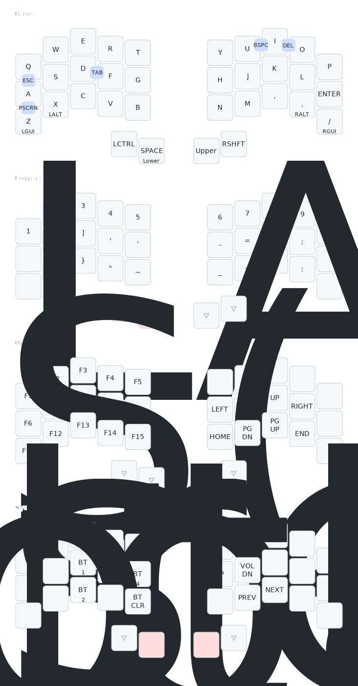

# ZMK Config - Urchin

This repository contains my ZMK configuration for an [Urchin](https://github.com/duckyb/zmk-urchin) keyboard by [Duckyb](https://github.com/duckyb). The Urchin is a 34 key keyboard that runs on [ZMK](https://zmk.dev/) via [nice!nanos](https://nicekeyboards.com/nice-nano/). 

## Keymap Cheat Sheet

> Keymap generated by [Caksoylar](https://github.com/caksoylar/keymap-drawer).

## Getting started

**Are you trying to make your own ZMK firmware?**  
[Here are the steps you need to take.](./GETTING_STARTED.md)

**Do you want to download my keymap?**  

[Download the firmware zip from the latest action run.](https://github.com/TahomaTech/zmk-config-urchin/actions) Check [the ZMK docs](https://zmk.dev/docs/user-setup#installing-the-firmware) for instructions on how to flash it.